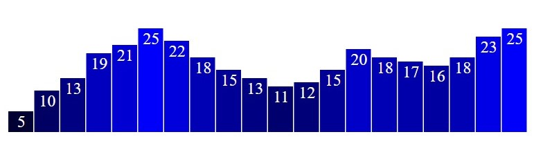

# Lesson 2 - Bar Chart and Interaction

## Outline
* SVG elements
* Adding Circles
* Bar chart
* Interaction
* Transition

## SVG Elements
From the file `d3_1_7.htm` remove all code inside the script tag and add a `div` to the `body` named `div_d3` before the script.
``` html
<div class="div_d3">    </div>
```

In the script tag select this div and add a SVG node to it.
``` javascript
let svg = d3.select('.div_d3').append('svg')
```

Modify the attributes `width` and `height` to 600 and 300, as the `background-color` to `#ffa07a`. Try changing these values and see how the SVG behaves.

### Adding Circles
Add a circle to the SVG node (`svg.append('circle')`) in the possition 300,150 with radius 50 and red color. More about circles [here](https://www.w3schools.com/graphics/svg_circle.asp)

Now modify the example using the following code, and change the color for `teal`:
``` javascript
let w = 500;
let h = 50;

let svg = d3.select("body").append("svg")
        .attr("width", w)
        .attr("height", h);
```

Add the following code and analyze what happens:
``` javascript
let dataset = [5, 10, 15, 20, 25];

let circles = svg.selectAll("circle")
    .data(dataset)
    .enter()
    .append("circle");

circles.attr("cx", "10")
        .attr("cy", "10")
        .attr("r", "10");
```
Modify the code in a way that the `x` position updates with the index of the data, `y` position being half of the SVG size and the radius is proportional to the data. In this case the functions have an additional argument, a counter variable automatically generated by D3. For example, for attribute `x` you can use:
``` javascript
circles.attr("cx", function (d, i) {
    return (i * 50) + 25;
});
```
At the end, it must show something like this:


Modify the data and see what happens. To better understand, put the `debugger` at the `cx` function to see the value `d`.

### Different Colors (optional)
Use the `style` method in the circles to change the properties of the circles (use one color for `fill` and another one for `stroke`, and bind the `stroke-width` for half of datum value). Reload the page, then modify the code to bind the color to the data, and add more values to the dataset. Analyze what happens.

## Bar chart
Let's do another bar chart, now using SVG elements. Make a copy of the `d3_2_3.htm` file and change the data to:

``` javascript
let dataset = [5, 10, 13, 19, 21, 25, 22, 18, 15, 13, 11, 12, 15, 20, 18, 17, 16, 18, 23, 25];
```

Change the circle's code for the bar's one:
``` javascript
let rects = svg.selectAll("rect")
    .data(dataset)
        .enter()
        .append("rect")
        .attr("x", 0)
        .attr("y", 0)
        .attr("width", 20)
        .attr("height", 100);
```
Modify the code to bind the `x` rectangle position to the index, SVG width and data length (`i * (w / dataset.length)`).  
Modify the bar's width to depend on data length (w / dataset.length - 1)
Change the dataset values and see the results. Now modify the code bind the height of the bars to four times the value (increase the SVG size if needed). What happens? The bars being upside down problem arises from the `0,0` cordinate from SVG. The `y` value must be updated to height minus the value to fix this.  
Finally, to add colors one can bind the `fill` style property to something like `"rgb(0, 0, " + (d * 10) + ")"`.

### Labels
Add the following code to visualize text in each bar:
``` javascript
svg.selectAll("text")
    .data(dataset)
    .enter()
    .append("text")
        .text(function (d) {
            return d;
        })
        .attr("x", function (d, i) {
                return i * (w / dataset.length);
        })
        .attr("y", function (d) {
            return h - (d * 4);
        });
```
Modify the text properties (namely the `text-anchor` one) to obatin the following chart:



## Interaction
Add the following code to add a callback to the click event of the bars:
``` javacript
rects.on("click", function(d) {
    console.log("The value is "+ d);
});
```
Open the console on the developer's tools to see the values when the bars are clicked. Now we will change the bars example a bit. Modify the example to sort the bars with a sort button. Add a button to the page with the the HTML tag or by script. With the HTML:
``` html
<button id="sort_button"> Sort </button>
```
And by script:
``` javascript
d3.select("body").append("button")
    .attr("id","sort_button")
    .text("Sort bars");
```
The following code sort the bars using a `sort` flag and the some sort helper (to sorte and define the rules to sort) functions of D3:
``` javascript
//Define sort order flag
var sortOrder = false;	
//Define sort function
var sortBars = function() {
    //Flip value of sortOrder
	sortOrder = !sortOrder;

	svg.selectAll("rect")
		.sort(function(a, b) {
			if (sortOrder) {
				return d3.ascending(a, b);
			} else {
				return d3.descending(a, b);
			}
		})
		.attr("x", function(d, i) {
    		return i * (w / dataset.length);
		})
};
```
Repeat the pattern for the labels.

### Transition
Using the `transition` function D3 updates the visual marks using animation. This animation allows interpolation between initial and final values. Add transition to the example, before the `x` attribute and reload the page. Note that the transition must be placed before the attribute/style property. The default time for animations is 250 ms. Use the `transition()` function adding the `duration(miliseconds)` to set the animatino time. Experiment with the `ease(easeType)`to the interpolation type. Try these: `d3.easeCubic`, `d3.easeLinear`, `d3.easeCircle`, `d3.easeElastic` and `d3.easeBounce`.  More on transitions [here](https://github.com/d3/d3-transition/blob/master/README.md#transition_delay).

### Optional
Add a start delay for both bars and labels based on the data values. For this use `delay()` after the `transition()`.
