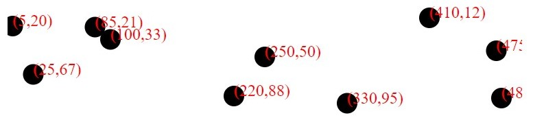

# Lesson 3 - Scatterplot and Scales & Axes

## Outline
* Scatterplot
* Load file
* Scales
* Axes
* Lines

## Scatterplot
For this chart the data is bidimensional, allowing specification of `x,y` on the plane. Add this data to the `d3_2_3.htm` file:
``` javascript
let dataset = [
    [ 5, 20 ],
    [ 480, 90 ],
    [ 250, 50 ],
    [ 100, 33 ],
    [ 330, 95 ],
    [ 410, 12 ],
    [ 475, 44 ],
    [ 25, 67 ],
    [ 85, 21 ],
    [ 220, 88 ]
    ];
```
Display the data using SVG circles with radius 5, cx `d[0]` and cy `d[1]`. Modify the code to randomly generate a 3 dimentional dataset using the first two values to x and y and the third one for radius. Use the following excerpt as example:
``` javascript
dataset[i] = [];
dataset[i][0] = Math.floor((Math.random() * 500));
```

### Optional
Add labels to each point, to get an image like this:


## Load file
Most data used for visualization is stored in files. Embbed data with the script is uncommon on real world, and now we will see how D3 handles this. Note that this only works on a web server. Create a new file with the following content:
``` html
<!DOCTYPE html >
<html>

<head>
    <meta charset="utf-8">
    <script src="http://d3js.org/d3.v5.js"></script>
    <script>
        let width = 500;
        let height = 300;
        let margin = 50;
        
        function draw(data) {
            // Reuse the visualization code from scatterplot
            // Change d[0] and d[1] as specified below
        }
    </script>
</head>

<body>
    <script>
            d3.json("MIECT_Alunos_Ano.json")
                .then(draw)
                .catch(function(err){console.log(err)});
    </script>
</body>

</html>
```
Note that the `MIECT_Alunos_Ano.json` file must be on the same directory of the page, or you'll need to manually modify path for this file.   
Modify the code of scatterplot to show the students of ECT by year (using the data loaded from file). Use in the `x` axis the `i` D3 provides times 50, and in the `y` use the `d.Numero_de_Alunos` and radius 10.

## Scale
D3 offers methods that transform data. These functions allow the mapping of the data __domain__ to a expected display __range__. For example, one can map data to age between 15 and 90 to a display pixel interval of 0 to 100. This can be done using the `d3.scaleLinear`.
Using the previous example, use scales to generate the points position. Start by setting the minimum and 
maximum values of the data distribution. D3 has a function for this, than returns a two-size array with min and max values from data:
``` javascript
let y_extent = d3.extent(data, function(d) {return d.Numero_de_Alunos });
```

Now we can create a scale for the `cy` position of the points (note the margin):
``` javascript
let y_scale = d3.scaleLinear()
    .range([margin, height - margin])
    .domain(y_extent);
```
Now we can use the scale on the position:
``` javascript
.attr("cy", function (d) {return y_scale(d. Numero_de_Alunos);})
```
Now create a scale for the `x` position, using values in the following range
``` javascript
var x_extent = [0, data.length];
``` javascript

## Axes
D3 also offers tools for visualizing axes. To visualize the x axis use the following code, that creates an axis with lines and labels  using a pre-defined scale:
``` javascript
let x_axis = d3.axisBottom(x_scale);
```
And now display it:
``` javascript
d3.select("svg")
        .append("g")
        .attr("class", "x axis")
        .attr("transform", "translate(0," + (height - margin) + ")")
        .call(x_axis);
```
This code groups the axis with a transform to draw it in the right position. Comment this line and see what happens. In the same way add an y axis using the `d3.axisLeft` function. Note that this axis is inverted in SVG. How to solve this using the scale?
To style the axes it you can add this CSS:
``` css
.axis path{
    fill:none;
    stroke: black;
}
.axis {
    font-size:8pt;
    font-family:sans-serif;
}
.tick {
    fill:none;
    stroke:black;
}
circle{
    stroke:black;
    stroke-width:0.5px;
    fill:RoyalBlue;
    opacity:0.6;
}
```
At the end, add a title for the scatterplot and for each axis. You can use the following picture as basis:


### Optional
Use the `d3.scaleOrdinal` to directly map the course years to a scale ("1º Ano", ... "5º Ano").

## Line
For the SVG primitives, it is fairly simple to generate a line using path. To create lines using D3 with only the selections we have seen so far is possible, but the exchange between the `M`, `L` or `Q` commands along the points can be troublesome. D3 has a solution for this problem, it provides a Line generator, that builds a `d` attribute ready for usage by a `path` tag. Using our example, it can be generated and used with this code:
``` javascript
let line = d3.line()
    .x(function (d,i) { return x_scale(i) })
    .y(function (d) { return y_scale(d.Numero_de_Alunos) });
d3.select("svg")
    .append("path")
    .attr("d", line(data))
    .attr("class", "linha_alunos");
```
See the results. You can style the line using CSS:
``` css
path {
    fill:none;
    stroke:black;
    stroke-width:2px;
}  
path.linha_alunos{
    stroke:DeepPink;
}
```

### Optional
Modify the example to read the `DETI_Dados_Candidatos` file and generate a chart with three lines showing the evolution of the 3 DETI courses in the last years.

