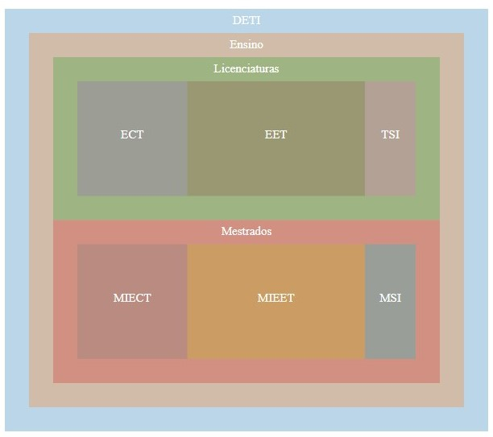

# Lesson 5 - Layouts

## Outline
* Force Layout
* Tree
* Treemap


## Force Layout

Force Layout uses a physics algorithm to define nodes position, and a timer (_tick_ event) allows change to the nodes properties in a timed scale. More [here](http://d3indepth.com/force-layout/).  
Run the `D3_5_1.htm` file. Note the file loading, modify the data to add a node to the visualization.

Modify the example to show the name above the node (Lesson 2.6). Change the data file adding a group to a node and a weight value.

``` javascript
// example
{ "name": "No 0", "group":1 },
{ "source": 0, "target": 1, "value":1 },
```
Use this information to map different groups  with different colors and the width stroke of links by its value, than one can obtain the following image:


You can add interaction, adding this to node:
``` javascript
.call(d3.drag()
    .on("start", dragstarted)
    .on("drag", dragged)
    .on("end", dragended)
);
```

And adding these functions:
``` javascript
function dragstarted(e, d) {
    if (!e.active) {
        simulation.alphaTarget(0.3).restart();
    }
    d.fx = d.x;
    d.fy = d.y;
}

function dragged(e, d) {
    d.fx = e.x;
    d.fy = e.y;
}

function dragended(e, d) {
    if (!e.active) {
        simulation.alphaTarget(0);
    }
    d.fx = null;
    d.fy = null;
}
```
Analyse the results, try drag the nodes. You can try the `miserables.json` file. Modify the visualization to your taste and tweak the force parameters.

## Tree
Now create a tree layout to visualize DETI hierarchy (deti.json). Start crating the hierarchy using this:
``` javascript
let root = d3.hierarchy(data);
```

Now create a tree using the hierarchy with the following:
``` javascript
let treeLayout = d3.tree()
    .size([400, 180]);

// this adds the data from the layout to hierarchy
treeLayout(root);
```

At the end, visualize the nodes and links using the following code to access the modified hierarchy. To visualize the nodes in the correct position use `d.x` and `d.y` of the `descendants`.

``` javascript
// Nodes
let nodes = svg.selectAll("circle")
    .data(root.descendants())
    .enter()
    .append("circle");
```
For the lines one can modify the attributes (x1, y1) and (x2, y2) using source (`d.source.x`,`d.source.y`) and target (`d.target.x`,`d.target.y`). Change color and stroke width of line and circles.
``` javascript
// Links
let links = svg.selectAll("line")
    .data(root.links())
    .join("line");
``` 
You can append the name using `d.data.name`. Note that the hierarchy return some 0 values, to move it one must do translation and by grouping it. 

## Treemap
Create a treemap layout from the DETI.json file using the structure od department. Change the code from hierarchy:
``` javascript
let root = d3.hierarchy(data)
    .sum(d => d.value)
    .sort((a, b) => b.value - a.value);
```
Then create the layout:
``` javascript
let treemapLayout = d3.treemap()
    .size([width, height])
    .paddingOuter(20);
```
Add the layout data to your hierarchy:
``` javascript
treemapLayout(root);
```

Now you can create the nodes using the hierarchy, and grouping the hierarchy. First we create a group, and the inside of it we create the rectangles:
``` javascript
let cells =svg.selectAll('g')
    .data(d3.group(root, d => d.height))
    .join('g')
        .selectAll("rect")
        .data(d => d[1])
        .join("rect")
```
You must add the data from (d.x0,d.y0) and (d.x1 and d.y1) to draw the rectangles. To add a different color for the leaves, you can bind a pre-made D3 color scale:
``` javascript
let color = d3.scaleOrdinal(d3.schemeCategory10);

// Add this to the rects
.attr("fill", function (d) { return color(d.data.name); })
``` 
Now you can add centered text in the leaves (d.children) to obtain the following image:



Try some options and the drawing mode. What's the default option?