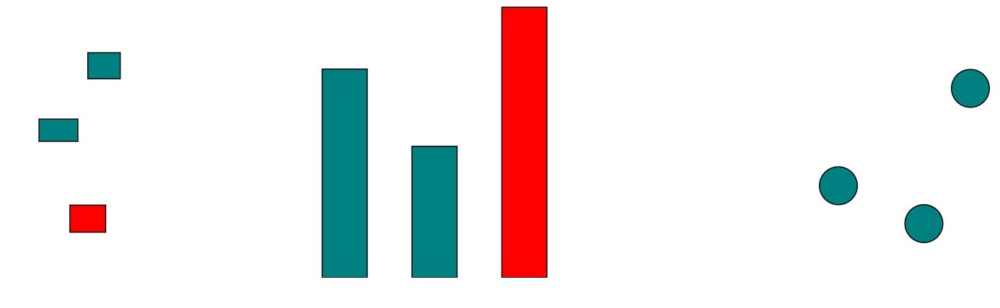

# Brushing and Filtering

This extra lesson shows how to apply a generic brushing and filtering on d3 visualizations. This guide will start over the `D3_brush_filter_01.htm` file and advances to the end.  

A map of some departments of UA, filled with random data are used. The `D3_brush_filter_01.htm` file has some boilerplate example of everything working separately. This is a generic solution, using a unique key for brushing and a single value for filtering, you should do the fine tunning for your project.  
Look for the `click` events and pay close attention for the how the drawing is modular. These modular drawing functions will allow the insertion of filter. Excerpts for the bar chart can be seen below:

``` javascript
let svgBars = d3.select("body").append("svg")
    .attr("width", width)
    .attr("height", height);

let xBars = d3.scaleBand()
    .rangeRound([margin, width-margin])
    .domain(data.map(d => d.name));

let yBars = d3.scaleLinear()
    .range([height - margin, margin])
    .domain([d3.max(data, d=>d.staff), 0]);

barScales = {"x":xBars, "y":yBars}; // only to encapsulate

drawBars(svgBars, barScales, data);
```

It is a simple vis, as shown below:



Starting with brushing, we will select the same object on all visualizations. The `d3.brush` function adds more complexity than it needs for this example, but there is plenty of documentation of it on the sources provided on the main [README](../README.md).  
Create a handler for the event of selection, than update using the key for each entrance, in this way:
``` javascript
// map example
.on("click", function(e, d) {
    handleSelection(d.properties.name); // delegate event
});

function handleSelection(key) {

    // reset visual display
    mapPaths.style("fill","teal");
    scatterCircles.style("fill","teal");           
    barsRect.style("fill","teal");

    // using filter it is possible to get the selection by the key
    mapPaths.filter(d => d.properties.name === key).style("fill","red");
    scatterCircles.filter(d => d.name === key).style("fill","red");
    barsRect.filter(d => d.name === key).style("fill","red");
}
```
This example is on `D3_brush_filter_02.htm` working for all visualizations, this way:


The `D3_brush_filter_03.htm` has examples of data filtering adding a slider and the events to redraw it. Pay attention to the map, how it starts different now:
``` javascript
// map
let svgMap; // separate the svg from the selection
d3.json("map.json")
    .then(data => {
        raw_geo_data = data; // save for filtering

        // create svg for map
        svgMap = d3.select("body").append("svg")
            .attr("width", width)
            .attr("height", height);

        drawMap(svgMap, data);
    })
    .catch(err => {console.log(err)});        
```

And for the filters, minor modifications must be made to update the chart lifecycle.

``` javascript
// join
barsRect = svgBars.selectAll("rect")
    .data(data)
    .join("rect") 
        .attr("x",d => xBars(d.name))
        .attr("y", d => height - yBars(d.staff))
        .attr("width", (width/2 - margin)/data.length)
        .attr("height", d => yBars(d.staff))
        .style("fill","teal")
        .style("stroke","black")
        .on("click", function(e, d) { // selection bars
            barsRect.style("fill","teal");
            d3.select(this).style("fill","red");
        });
```

Add a slider to the HTML:
``` html
<div id="filter_container">
    <label>Events: <input type="range" id="filter_slider"/> </label>
    <p id="label"> </p>
</div>
```

At the end, bind the drawing to the `input` event:
``` javascript
// filter
let slider = d3.select("#filter_slider");
let label = d3.select("#label");

let min = 0, 
    max = d3.max(raw_data,d => d.events) + 10;
slider
    .attr("min", min)
    .attr("max", max)
    .attr("value", 1)
    .attr("step", 1)
    .on("input", function(e, d) {
        label.text(this.value); // use `this` on the place of slider 
        let dataFiltered = data.filter(d => d.events > this.value); // filter using value
        drawBars(svgBars, barScales, dataFiltered);
        drawScatter(svgScatterplot, scatterScales, dataFiltered);
        
        // get names from filtered data and update features
        let keys = dataFiltered.map(d => d.name);
        let geo_data_filtered = JSON.parse(JSON.stringify(raw_geo_data)); // deep copy of object
        geo_data_filtered.features = raw_geo_data.features.filter(d => {
            return keys.includes(d.properties.name); // filter by names
        })
        drawMap(svgMap,geo_data_filtered);
    });
```

The file `D3_brush_filter_04_complete.htm` has everything tied together.