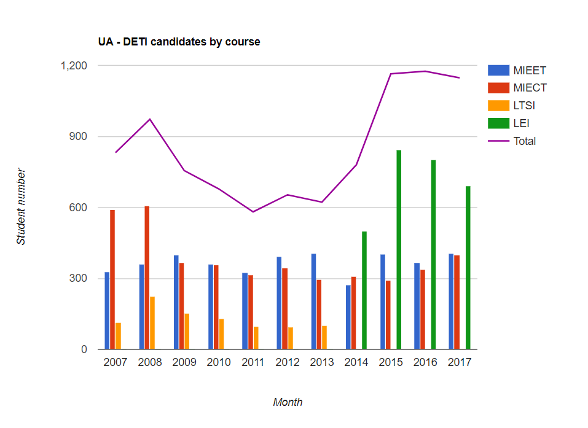
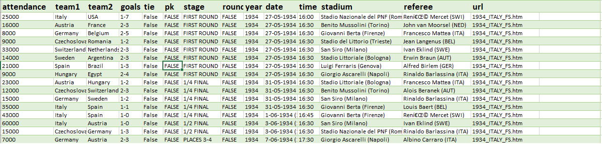
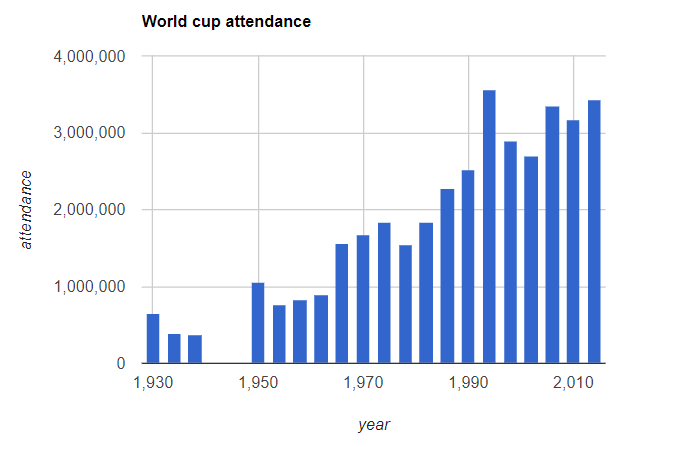

# Visualization examples with Google Charts

__Outline__
* Basic Charts: 
    *	Pie charts
    *	Bar charts
    *	Columns charts
    *	Line charts
    *	Combo charts
* Visualization example – World cup dataset
    * Grouping data
* Miscellaneous
    * Geo charts
    * Org charts / Tree maps


## 1. Basic Charts
## 1.1 Pie charts
Analyse the `GCT_ex_01.htm` file. See how the main components of visualization are defined. Which interactions are available? Also check the attributes that are defined by default and those that need to be explicitly defined.  
Double the dimension of the visualization area and modify also the Pie visualization to be in 3D. More [here](https://developers.google.com/chart/interactive/docs/gallery/piechart).

We suggest activating the debugger options of your browser to check the console. (Options->More Tools->Developer Tools or _CTRL+SHIFT+I_)

## 1.2 Bar charts
Based on the previous example, represent the same data using a Bar Chart. 
The interval associated to the horizontal axis seems adequate to represent accurately the data? Why? Modify the axis value to provide a visualization less misleading and remove the legend that is redundant. More [here](https://developers.google.com/chart/interactive/docs/gallery/barchart).

## 1.3 Column charts

Adapt the previous example to show the data in a column Chart instead of a bar chart, perform the necessary customization as in the previous example. More [here](https://developers.google.com/chart/interactive/docs/gallery/columnchart).

## 1.4	Line Charts

Consider the file `DETI_Dados_Candidatos.xlsx` that contains the information relative to the number of candidates to DETI courses (MIEET, MIECT  LTSI e LEI) from 2007 to 2012.

``` javascript
[ ['2007', 328, 589, 115, 0],
['2008', 361, 605, 223, 0],
['2009', 400, 365, 152, 0], 
['2010', 360, 357, 129, 0],
['2011', 325, 316, 96, 0],
['2012', 394, 344, 93, 0],
['2013', 404, 294, 102, 0],
['2014', 271, 307, 0, 501],
['2015', 402, 291, 0, 843],
['2016', 367, 337, 0, 802],
['2017', 407, 399, 0, 691] ]
```

First represent this data using a ColumnChart. In this case since we have several courses a legend should be presented with the chart.	

Now represent the same information using a Line chart. If you are interested in the evolution of the number of student in each course, which chart seems more adequate, a column or a line chart? On the other side which chart would you use to compare the number of student between courses? More [here](https://developers.google.com/chart/interactive/docs/gallery/linechart).

## 1.5 Combo charts
Modify the previous example to present a combo chart like the following figure. Notice that in this visualization we also present the total of candidates in each year. 
More [here](https://developers.google.com/chart/interactive/docs/gallery/combochart)
``` javascript
['2007', 328, 589, 115, 0, 831],
['2008', 361, 605, 223, 0, 972],
['2009', 400, 365, 152, 0, 755], 
['2010', 360, 357, 129, 0, 678],
['2011', 325, 316, 96, 0, 581],
['2012', 394, 344, 93, 0, 653],
['2013', 404, 294, 102, 0, 622],
['2014', 271, 307, 0, 501, 780],
['2015', 402, 291, 0, 843, 1164],
['2016', 367, 337, 0, 802, 1175],
['2017', 407, 399, 0, 691, 1147],
```




## 2. World cup example
Consider the file `world_cup.csv` and inspect the code available in `GCT_ex_07.htm` to load the data. Notice that this code is using the external library (`jquery` and `jquery.csv`) to load the data from the file.  



Run the example and try to understand the code. Namely the line where the data is loaded and selection of the columns to display in each axis.
What data is displayed in the chart? How is this specified?

## 2.1 Grouping data
Imagine you would like to see the total attendance in each year, you would need to sum the attendance of all the games of a given year. This can be done in Google Charts using a function as follow:
``` javascript
// This call will group the table by column 0 values.
// It will also show column 8, which will be a sum of
// values in that column for that row group.

// Grouping of data
var result = google.visualization.data.group(
	data,
	[8],
	[{'column': 0, 'aggregation' : google.visualization.data.sum, 'type' : 'number'}]
);
```
The resulting data of the grouping will have two columns: year (column 0) and total attendance attendance (column 1). More [here](https://developers.google.com/chart/interactive/docs/reference#data-manipulation-methods).

Modify the code to visualize the following ColumnChart:



## 2.2 Line chartNow modify the previous chart to present the data in a line chart. On one side the evolution of the attendance to the games is clearer, on the other side, the WWII effect has disappeared. 
Use the point options to show a marker at each data showing at the same time the line (evolution) and a marker of your choice to represent the data (each 4 years and WWII effect). More [here](https://developers.google.com/chart/interactive/docs/points)


## 3. Miscellaneous
## 3.1 Geo Charts
Consider the `Censos_2011_Densidade_Populacional.xls` file containing, for each portuguese province, the number of habitants per Km<sup>2</sup> according to the 2011 Portuguese population survey.
Complete the `GCT_ex_11.htm` example to represent the information relative to the 20 provinces with larger population density (add 5 provinces from the file).
Test the various interaction functionalities available in the example.

Outdated: you need to get a google API key to get the example running in full see: https://developers.google.com/maps/documentation/javascript/get-api-key#restrict_key

## 3.2 Org charts / Tree maps
Build an Org chart representing the internal structure of the DETI. The final visualization should use the abbreviates as labels and the size to map the number of persons in each group. Use the following data:
```
DETI(549)
    Teaching (400)
        Undergraduate (200)
        Masters (200)
    Research (149)
        IEETA - Institute of Electronics and Informatics Engineering of Aveiro (87)
        IT – Telecomunication Institute (62)
```

Visualize in the same window, below the Org chart a Tree map representing the same structure. More [here for org charts](https://developers.google.com/chart/interactive/docs/gallery/orgchart) and [here for tree maps](https://developers.google.com/chart/interactive/docs/gallery/treemap)
