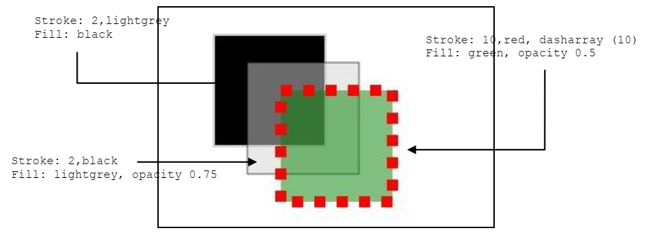
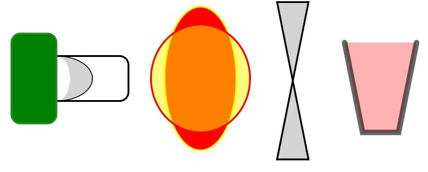
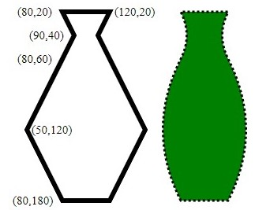
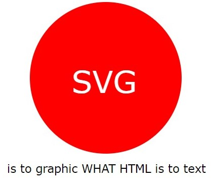
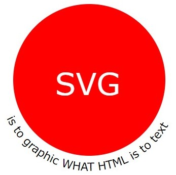

# SVG Introduction

## Outline
* Presentation attributes
* Basic Shapes 
* Image Element
* Path and Curves
* Text
* Animation
* Path and text
* Miscellaneous

## _fill_ and _stroke_

Save the code below in a `html` file
and load it.

``` html
<!DOCTYPE html>
<html>
<head>
</head>
<body>

<svg width="300" height="200">
    <title> Exercise 1.1 </title>
    <desc> SVG First Example </desc>
    <rect x="80" y="50" width="100" height="150"/>
</svg>

</body>
<html>
```

Add the attributes `stroke="black"` and `fill="lightgrey"` and see the changes. Try to modify the example to obtain the results of the image below, manipulating _fill_ and _stroke_ options (fill, fill-opacity, fill-rule, stroke, stroke-width, stroke-opacity, strokedasharray). More [here](http://www.w3.org/TR/SVG/painting.html).



## Basic shapes

Create a new SVG file with four shapes of the following table (between them a polyline and a polygon). Experiment with zoom-in and zoom-out, observe what happens compared with raster images. More [here](http://www.w3.org/TR/SVG/shapes.html)

| Shape | Tag | Mandatory attribute | Optional attribute |
| --- | --- | --- | --- | 
| Line | `<line>` | (none) | `x1, x2, y1, y2` |
| Rectangle | `<rect>` | `width, height` | `x, y, rx, ry` |
| Circle | `<circle>` | `r` | `cx, cy` |
| Ellipse | `<ellipse>` | `rx, ry` | `cx, cy`
| Polyline | `<polyline>` | points | - |
| Polygon | `<polygon>` | points | - |

### Optional
Replicate the figures of the image below using SVG.



## Transforms
Use the `transform` attribute to apply a 1/2 scale factor to one of the rects created, rotate it by 45 degrees and apply a translation of `(-20,10)`. More [here](http://www.w3.org/TR/SVG/coords.html)

## Images
Modify an example to load and show an image inside the SVG area. More [here](http://www.w3.org/TR/SVG/struct.html)

## Path and curves
Use the `path` element with the `L` option to get the jar of figure below. More [here](http://www.w3.org/1999/07/30/WD-SVG-19990730/paths.html).



Modify the jar using the `Q` (Quadratic Bézier) to obtain the curved jar. Visualize it side by side.

### Optional
Create a figure that shows simplified flags of four countries in a table two by two. Add countries images to show it side by side with its flag.

## Text 
Save the excerpt below in a `html` file
and load it.

``` xml
<title> Exercicio 1.1</title>
<desc> Exemplo de texto </desc>
<svg width="350" height="200">
<text x="30" y="50" font-size="10">
 Hello World
</text>
</svg>
```
Try to get a red text with size 12 and a Verdana font.  

Now create a red circular annoucement with a text that shows: "SVG is to graphics what HTML is to text" like the image below:



Enrich the example using some properties of the element, like `tspan` to increase the characters spacing difference to put the second character lower. More [here](http://www.w3.org/TR/SVG/text.html).


## Animation
Modify the example to change the text size in the center of the circle alternating on two sizes, simulating a pulsating heart, using the animation like this:  

``` xml
<animate attributeName="x" values="10;20;10" dur="3" repeatCount="indefinite"/>
```  

Transform the circle in a heart using a cubic bézier spline.
Try animating other attributes (color, character position). More [here]( https://www.w3.org/TR/SVG/animate.html).  

### Event animation
Use the `begin` element on the animation to allow the animation to start on click (`onclick`) in the text on in the circle. More [here](https://www.w3.org/TR/SVG/interact.html#SVGEvents)


## Path and text
Use `textpath` to modify the text below the circle like the following image. More [here](http://www.w3.org/TR/SVG/text.html#TextPathElement), [here](https://www.w3.org/TR/SVG/paths.html#PathDataEllipticalArcCommands) and [here](http://www.w3schools.com/svg/svg_path.asp)



### Animating through path
In a `textpath` element, add an animation using the `startOffset` attribute, allowing the text animation through the path. You can use the `animateMotion` to move a element (text, primitive) through a defined path.

## Miscellaneous
### Hyperlinks
Use the `<a>` tag to link with pages.

### Group tag
Use the `<g>` tag to group different elements. They will share some elements and can be changed simultaneously.
