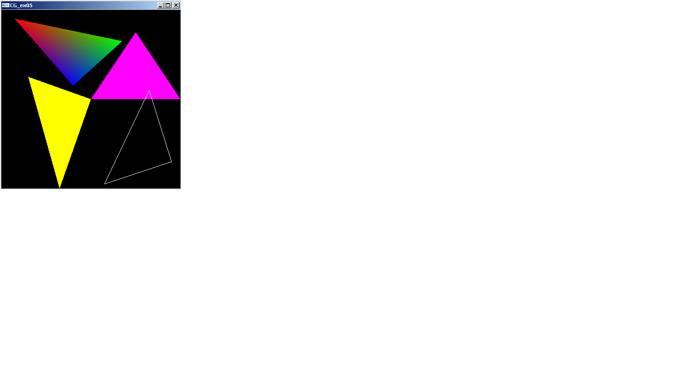

# Lesson 1 - three.js Introduction

## Outline
* Configuração do ambiente de desenvolvimento
* Primeiro exemplo, blocos para a visualização
* Visualização de uma malha poligonal / cor
* Atualização do viewport
* Outras primitivas 
 

## Configuração three.js 
O three.js é uma biblioteca construída sobre o webGL para abstrair alguma da complexidade associada a essa ferramenta e reduzindo a quantidade de código a escrever. Sendo assim a configuração do ambiente é semelhante ao webGL.
Para usar o three js pode incluir a linha seguinte no ficheiro html :


``` html
<script src="https://rawgithub.com/mrdoob/three.js/master/build/three.js"></script>
```

Em alternativa pode fazer o download do three.js em http://threejs.org/ e fazer uma instalação local usando o link:

``` html
<script src="js/three.min.js"></script>
```

Pode visualizar alguns exemplos em: http://threejs.org/examples/

## Primeiro exemplo 
Crie um exemplo em three.js baseado no tutorial disponível em:
https://threejs.org/docs/index.html#manual/introduction/Creating-a-scene
Note os vários passos necessários para criar e visualizar uma cena:

1.	Definição da cena, da câmara e do renderer onde a cena é desenhada:
``` html
var scene = new THREE.Scene();
var camera = new THREE.PerspectiveCamera( 75, window.innerWidth / window.innerHeight, 0.1, 1000 );

var renderer = new THREE.WebGLRenderer();
renderer.setSize( window.innerWidth, window.innerHeight );
document.body.appendChild( renderer.domElement );
```
2.	Criação de um objeto e da posição da câmara:
``` html
var geometry = new THREE.BoxGeometry(1,1,1);
var material = new THREE.MeshBasicMaterial( { color: 0x00ff00 } ); 
var cube = new THREE.Mesh( geometry, material ); 
scene.add( cube ); 
camera.position.z = 5;
```
3.	Renderização da cena: 
``` html
function render() {
	requestAnimationFrame(render);
	renderer.render(scene, camera);
}
```
4.	Animação da cena: 
``` html
cube.rotation.x += 0.1;
cube.rotation.y += 0.1;
```
## Adição de cor
Para permitir o mapeamento de uma cor diferente em cada vértice é necessário associar uma cor a cada vértice. Tal pode ser feito da forma seguinte:

``` html
geometry.faces[0].vertexColors[0] = new THREE.Color(0xFF0000)

```
Sendo depois criado um material baseado nessa informação:
``` html
var geometryMaterial = new THREE.MeshBasicMaterial({
vertexColors:THREE.VertexColors});
```
Modifique o exemplo anterior para que as cores dos vértices sejam azul, amarelo e vermelho.
Modifique depois o exemplo para criar a figura que segue usando as coordenadas 2D seguintes:
``` html
(0.0,  0.0,  0.0) ( 0.5,  0.75, 0.0) ( 1.0,  0.0,  0.0);
(0.0,  0.0,  0.0) (-0.35,-1.0,  0.0) (-0.7,  0.25, 0.0);
(-0.2, 0.15, 0.0) ( 0.35, 0.65, 0.0) (-0.85, 0.9,  0.0 );
(0.15,-0.95, 0.0) ( 0.90,-0.7,  0.0) ( 0.65, 0.10, 0.0); 
```

Se não conseguir visualizar bem os triângulos, ative no material a opção side: THREE.DoubleSide. Para que serve esta opção? Como pode resolver o problema de outra forma?
Para o último triângulo deve criar outro modelo utilizando a propriedade wireframe do MeshBasicMaterial.


## Atualização do Viewport
Voltando ao exemplo inicial (cubo a rodar). Visualize o exemplo e tente redimensionar a janela do navegador. O que acontece? Isso ocorre porque as caraterísticas da janela de visualização (viewport) não são atualizada quando se muda o tamanho do navegador.
Para resolver este problema, crie uma função a ser chamada quando a janela é redimensionada. Essa função deve aceder ao tamanho da janela (window.innerWidth
 e window.innerHeight) e atualiza o tamanho do renderer (renderer.setSize()),  assim como a razão de aspeto da câmara (camera.aspect=…) atualizando a mesma (camera.updateProjectionMatrix()).
Coloque o código necessário na função seguinte para permitir o correto redimensionamento do viewport e observe o resultado.

``` html
window.addEventListener('resize', function () {				       
	… código para atualizar o viewport
		});
```
## Outras primitivas
Modifique o código para visualizar o cube em wireframe.
Consulte outras geometrias disponíveis (Extras / Geometries) e tente visualizar outras geometrias alterando os seus parâmetros. 

