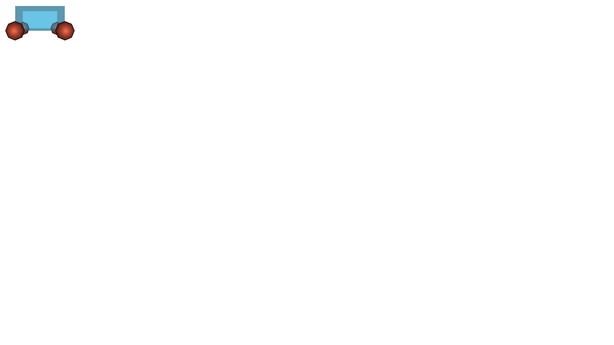
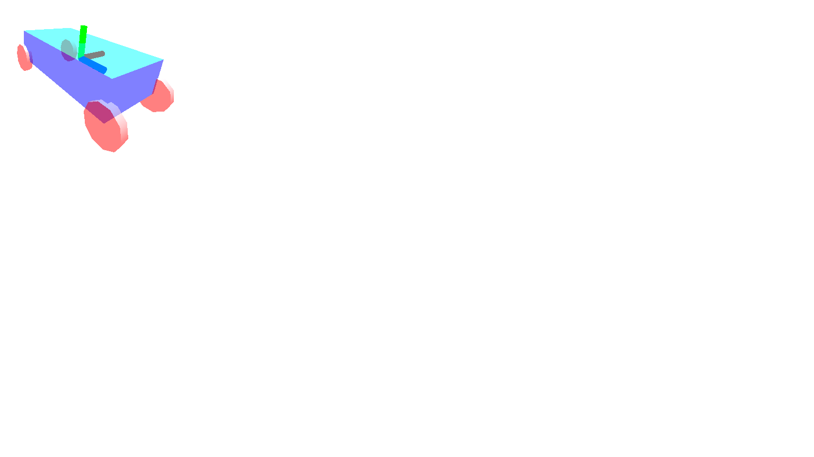

# Lesson 2 - Aula 2- Projeções, iluminação e transformações

## Outline
*	Tipos de câmaras: projeção perspetiva e paralela ortogonal
*	Interação com câmara
*	Iluminação e sombreamento
*	Transformações

# Tipo de Câmaras
Modifique o primeiro exemplo da última aula para visualizar o cubo em wireframe, para tal deve ativar a propriedade adequada do material (pode ir buscar o código em https://threejs.org/docs/index.html#manual/introduction/Creating-a-scene). Desative a rotação do cubo.

Em vez de utilizar uma câmara perspetiva, utilize agora uma câmara do tipo OrthographicCamera. Note que nesta câmara são especificados os limites superiores em x e y da cena e não o ângulo de abertura da câmara como no caso da câmara perspetiva. Modifique os parâmetros para que a zona de visualização do mundo seja entre -3 e 3 no eixo das abcissas, e respeite a razão de aspeto da janela. Compare o resultado com as duas câmaras é o que esperava?

Opcional: Acrescente uma função para garantir que o cubo não é deformado quando o tamanho da janela é modificado (adapte o exemplo 1.5 da última aula).

# Orbit control
O three.js disponibiliza algumas classes para permitir um fácil controlo da câmara como é o caso do OrbitControls.js. Note que para usar esses controlos é preciso uma cópia local do script onde esses controlos estão definidos. Pode fazer o download do three.js em http://threejs.org/ sendo que a biblioteca a usar está na pasta:
``` html
threejs folder > examples > js > controls > OrbitControls.js
``` 
No exemplo anterior substitua o controlo da câmara pela linha seguinte e veja o que acontece:
``` html
var controls = new THREE.OrbitControls(camera);
``` 
Não se esqueça de fazer o update dos controlos na função de desenho: 
``` html
controls.update();
```
Existem outros controlos. Experimente alguns, por exemplo o: TrackballControls 

# Iluminação e materiais
Vamos agora adicionar luzes na cena. 
Volte a ativar a rotação e visualizar o cubo sem ser em wireframe. 
Crie uma DirectionalLight na posição 0,5,0 com a cor 0xffffff e intensidade 1.0. Não se esqueça de a adicionar a cena. Vê alguma alteração na cena? Para que o objeto interaja com a luz é necessário utilizar um material de um tipo diferente, utilize um material do tipo MeshPhongMaterial e observe novamente.
``` html
var material = new THREE.MeshPhongMaterial({
            color: '#006063',
		specular: '#a9fcff',
		shininess: 100
            });
``` 
Adicione uma luz ambiente, note (note que a componente de luz ambiente (color) do material só é usada se uma luz ambiente está definida), por exemplo: 
``` html
var alight = new THREE.AmbientLight(0xffffff);
scene.add(alight);
``` 

# Sombreamento
Modifique o exemplo base (cubo a rodar) para representar não um cubo mas uma esfera (primitiva sphereGeometry) de raio 1. 
Modifique os parâmetros 2 e 3 com a opção wireframe ativa. Ao que correspondem os parâmetros widthSegments e heightSegments? Desative o wireframe e coloque o número de segmentos a 10. 

Crie agora outra esfera com as mesmas caraterísticas e coloque uma esfera em x=-2.5 e a outra em x =2.5 (use o método position.x).

Adicione a luz ambiente e a luz direcional do exemplo 2.3 entre as duas esferas com y=5. Aplique dois materiais iguais do tipo MeshPhongMaterial as duas esferas (use o exemplo anterior). Modifique a opção de flatShading de um dos materiais alternando entre true e false e veja o resultado. 

Opcional : Aplique a esfera 1 um material do tipo MeshLambertMaterial com as mesmas caraterísticas da esfera 2. No material do tipo Lambertiano, retire as componentes specular e shininess. O que observa? Os materiais lambertianos dispersam a luz de igual forma em todas as direções pelo que o coeficiente especular e o brilho são ignorados.

Pode ainda modificar as propriedades das esferas a seu gosto usando alguns valores da tabela seguinte (note que o brilho deve ser multiplicado por 256). Veja o exemplo:
``` html
var esmeralda = new THREE.MeshPhongMaterial({
shading: THREE.SmoothShading	});
esmeralda.color = new THREE.Color(0.07568, 0.61424, 0.07568);
esmeralda.specular= new THREE.Color(0.633, 0.7278, 0.633);
esmeralda.shininess = 0.6 * 256;
``` 
Nome             |	Ambiente                      |Difuso	                        |Especular	                        |Brilho
-----------------|------------------------------------|-----------------------------------|-----------------------------------|----------:
esmeralda        |0.0215	0.1745	0.0215      |0.07568	0.61424	0.07568     |0.633	0.727811	0.633       |0.6
ouro             |0.24725	0.1995	0.0745      |0.75164	0.60648	0.22648     |0.628281	0.555802	0.366065    |0.4
prata            |0.19225	0.19225	0.19225     |0.50754	0.50754	0.50754     |0.508273	0.508273	0.508273    |0.4
plástico preto   |0.0	0.0	0.0                     |0.01	0.01	0.01                    |0.50	0.50	0.50                    |0.25
plástico vermelho|0.0	0.0	0.0                     |0.5	0.0	0.0                     |0.7	0.6	0.6                     |0.25
plástico branco  |0.0	0.0	0.0                     |0.55	0.55	0.55                    |0.70	0.70	0.70                    |0.25
borracha preta   |0.02	0.02	0.02                    |0.01	0.01	0.01                    |0.4	0.4	0.4                     |0.0781
borracha vermelha|0.05	0.0	0.0                     |0.5	0.4	0.4                     |0.7	0.04	0.04                    |0.0781
borracha branca  |0.05	0.05	0.05                    |0.5	0.5	0.5                     |0.7	0.7	0.7                     |0.0781

Se o desejar pode utilizar os endereços seguinte para visualizar outros efeitos de iluminação ou outros materiais usando:

http://www.realtimerendering.com/teapot/

http://www.lighthouse3d.com/2014/01/webgl-basic-material-list-from-teapots-c/

Opcional: Acrescente as seguintes luzes no ambiente, todas a apontar para a origem
Luz direcional vermelha na posição (-5,0,0) 
Luz direcional azul na posição (5,0,0) 
Luz tipo spotlight verde na posição (0,0,-5)

# Transparência
Acrescente no exemplo 2.4 uma esfera (ou um cubo) a volta das duas esferas do exemplo anterior (defina o modelo com um tamanho ligeiramente maior).
Utilize o material seguinte para esses dois modelos e observe o efeito, modifique o parâmetro opacity para ajustar a transparência. 
``` html
var glassMaterial = new THREE.MeshPhongMaterial( { 
color: 0x222222, 
specular: 0xFFFFFF,
shininess: 100, 
opacity: 0.3, 
transparent: true 
} );
``` 

# Transformações (escala e rotação)
Crie uma nova cena constituída por um paralelepípedo de tamanho (2,1,4) (use a propriedade scale) na posição (0,0,0) e quatro esferas (raio 0.5) centradas nos seus vértices inferiores (ver figura). Em vez de adicionar várias malhas separadas, pode adicionar as várias malhas num único THREE.Object3D() através do comando add. 
Visualize na consola as matrizes de transformação do paralelepípedo e de uma das esferas acedendo a matriz (matrix) com as transformações dos objetos.

   


# Transformações (rotações)
Crie um objeto que represente um sistema de coordenadas usando três cilindros (CylinderGeometry) vermelhos, verdes e azuis para cada eixo. Os três cilindros devem pertencer a um único objeto com o nome eixo. Adicione este objeto a cena anterior e substitua as esferas por cilindros com raios 0.5 e altura 0.2.

