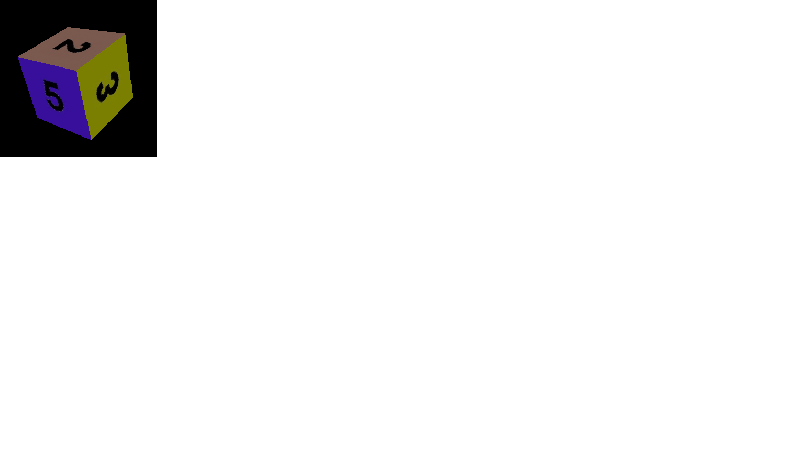

# Lesson 3 - Textura e Interação

## Outline
* Textura
* Combinação de textura e iluminação
* Interação com teclado

#	Utilização de uma textura num plano
Modifique o programa exemplo base (o cubo) para permitir visualizar um plano (PlaneGeometry). 
Utilize o atributo map do Material para aplicar a imagem Lena.jpg como textura do plano. Para ler a imagem, pode usar o código seguinte:
``` html
var texloader = new THREE.TextureLoader();
var tex=texloader.load("../images/lena.jpg");
``` 
Note que muitos navegadores, por razões de segurança, limitam o acesso a ficheiro locais pelo que neste exemplo pode haver problemas ao carregar a imagem. Pode se resolver esse problemas colocando todos os ficheiros num servidor local ou habilitando o navegador a aceder a ficheiros locais. O Firefox, não tem esse problema, mas no chrome, deve ser invocado o navegador com o comando seguinte: chrome -allow-file-access-from-files. Em alternativa, pode se usar um servidor, por exemplo em python. Para configurar um servidor em python, basta instalar o python (http://python.org) e correr o código seguinte numa linha de comandos: python -m SimpleHTTPServer 8000 acedendo depois ao endereço http://localhost:8000.

Tente alterar o tamanho do Plano, o que é que acontece a textura?

#	Textura num cubo
Voltando ao exemplo do cubo. Utilize a imagem lena.jpg como textura para o cubo. Como é mapeada a imagem para o cubo.
Modifique o programa para mapear uma imagem diferente para cada face do cubo (use as imagens Im1.jpg, Im2.jpg... Im6.jpg), Para tal crie um agregado para os materiais (var materials = []) na qual são colocadas todas as texturas usando o comando push. Modifique o comando de criação da malha para usar texturas múltiplas associadas a cada face da malha obtendo o resultado da figura seguinte.
``` html
var cube = new THREE.Mesh(geometry, materials);
``` 
Pode adicionar um OrbitControls para controlar a posição e orientação do cubo (ver 2.2 da última aula).

 


# Textura e iluminação
Crie um programa para visualizar uma esfera de raio 1 (use 32 segmentos em largura e altura). Aplique na esfera a textura de planisfério (earth_surface_2048.jpg). Visualize o modelo com uma rotação fixa no eixo dos Z (use 0.41 rad) e com uma animação (uma rotação a volta do eixo dos y de 0.0025 rad).
Adicione agora iluminação na cena. Utilize um material do tipo MeshPhongMaterial com a textura (em vez de um MeshBasicMaterial). Adicione ainda uma luz ambiente com o valor 0x333333 e uma luz direcional com direção (1,0,0) e com o valor 0xfffff a representar o sol. 
# Interação
Adicione o código seguinte no programa rara responder ao evento keydown.
``` html
document.addEventListener("keydown", onDocumentKeyDown, false);
``` 
Adicione também uma função para indicar qual a tecla que foi premida na consola. Pode usar o código seguinte:
``` html
function onDocumentKeyDown(event){ 
// Get the key code of the pressed key 
var keyCode = event.which;
console.log("tecla " + keyCode);
}
``` 
# Ativação iluminação
Modifique o código para permitir ligar / desligar a luz direcional através da tecla L (pode ser feito removendo a luz da cena, ou alterando o material para um MeshBasicMaterial, veja a diferença entre estes dois métodos).

Adicione ainda a opção de aumentar/diminuir a intensidade da luz através das teclas + e -. Use o código da alínea 3.4 para ver o código das teclas a usar.

#	Alterar rotações e posições
Utilize as teclas de direção para aumentar/diminuir a velocidade de rotação a volta dos eixos yy [esquerda e direita] e xx [cime e baixo] e as teclas page Up/Down para inclinar mais ou menos o modelo a volta do eixo zz.

# Concatenação de transformações / adição da lua
Adicione um novo modelo para representar a lua usando a texture moon_1024.jpg. e considere as constantes seguintes:
``` html
DISTANCE_FROM_EARTH = 356400;
PERIOD = 28;
INCLINATION = 0.089;
SIZE_IN_EARTHS = 1 / 3.7;
EARTH_RADIUS = 6371;
``` 

Para permitir a lua rodar a volta da terra, note que tem que criar a lua como um filho da terra para ser influenciada pelas transformações da terra (as transformações aplicadas a terra são automaticamente aplicadas a lua, multiplicando as matrizes de transformações dos dois objetos). Para tal o modelo da lua deve ser adicionado (add) ao modelo da terra. Considere as transformações seguintes para inicializar a lua na posição correta e aplicar a animação correta a mesma:

``` html
var distance = DISTANCE_FROM_EARTH / EARTH_RADIUS;
moon.position.set(Math.sqrt(distance / 2), 0,
-Math.sqrt(distance / 2));

// Rotate the moon so it shows its moon-face toward earth
moon.rotation.y = Math.PI;
moon.rotation.x = INCLINATION;

// For animation 
moon.rotation.y += (earth.rotation.y / PERIOD);
``` 