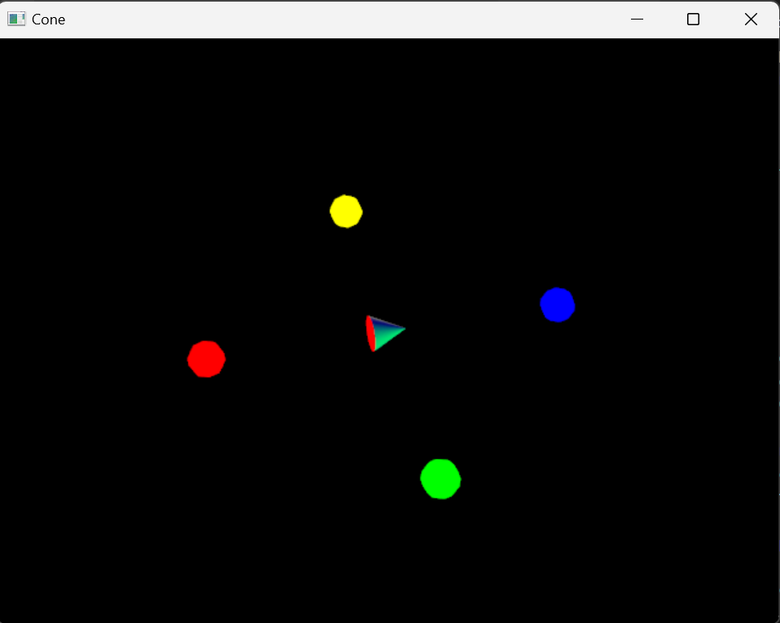

# Lesson 1 - Introduction to VTK

## Outline
* VTK installation
* First VTK example, Visualization pipeline
* VTK Interactors
* Camara control
* Lighting
 

## VTK / Python configuration 
The Visualization Toolkit (VTK) is open source software for manipulating and displaying scientific data. It comes with state-of-the-art tools for 3D rendering, a suite of widgets for 3D interaction, and extensive 2D plotting capability.
To install VTK and its python wrapper, report to the following link: https://pypi.org/project/vtk/

It is also possible to downlaod  VTK from https://vtk.org/download/


## First example 
Download and run the cone.py example.
See the documentation page for the [vtkConeSource](https://vtk.org/doc/nightly/html/classvtkConeSource.html) method. Use the necessary methods so that the Cone has a height of 2, and a radius of 1. Run some tests with the SetResolution method. What is this method used for?
Use the Renderer's SetBackground method to change the background color to white.
Add a line of code following the vtkRenderWindow definition to change the window size to (300x300) using the SetSize() method. What is the default window size?

## Other primitives
Modify the code to show a sphere (vtkSphereSource) and then a cylinder (vtkCylinderSource). The sphere must have a radius of 2, and the cylinder a radius of 2 and a height of 3. See in both cases the effect of the SetResolution method.

## Introducing interaction
Replace the code for the rotation with the following:

``` html
# Adds a render window interactor to the cone example to
# enable user interaction (e.g. to rotate the scene)
iren = vtkRenderWindowInteractor()
iren.SetRenderWindow(renWin)
iren.Initialize()
iren.Start()
``` 

This modification allows the user to interact with the VTK window through an interactor in order to visualize objects in a more intuitive and controlled way. Try to find out what the effect of the following keys are:

* Mouse left button (Rotate)
* Mouse right button (Pan)
* Mouse wheel (Zoom)
* Key F (Fly-To)
* Key P (Pick)
* Key R (Reset)
* Key S (Surfaces)
* Key W (Wireframe)
* Key J/ Key T (Joystick or Trackball Style)
* Key E  (Exit)

## Camera control
Add the following lines of code after the creation of the renderer. What happens? Set the camera parameters to a Position of (10,10,0) and a View Up Vector (0,1,1), what do you see? Modify the position and orientation of the camera.

``` html
cam1 = vtkCamera()
cam1.SetPosition(10,0,0)
cam1.SetViewUp(0,1,0)
ren.SetActiveCamera(cam1)
```
Modify the code to obtain the same result without having to create a new camera (the idea is to access the camera created by default by the Renderer with the GetActiveCamera method).

Set the camera to orthographic view (SetParallelProjection(True)) and visualize a cube in wireframe with the camera in orthographic or projection
view. What do you see?

## Lighting
Replace the camera code with the following in the example provided. What is its effect?

``` html
cam1 = ren.GetActiveCamera()
light = vtkLight()
light.SetColor(1,0,0)
light.SetFocalPoint(cam1.GetFocalPoint())
light.SetPosition(cam1.GetPosition())
ren.AddLight(light)

```

## Actor properties
In VTK, it is possible to modify the properties that control the appearance of an actor. One of the most used properties is color. Modify the example change the color of the cone to Red. To do so, use the VTK's SetColor property. Note that to access an actor's properties, it is necessary to use the GetProperty method.

``` html
coneActor.GetProperty().SetColor(0.2, 0.63, 0.79)
```

The actor's representation can also be changed. See the VTK help and try to find out the options to change the representation to points, wireframe, or surface. Test these various options.

You can also modify the transparency of an object using the setOpacity method. Try the values ​​0, 0.5 and 1. What happens?
<!-- 
talvez melhor deixar isto para a aula dois com mais algo sobre ilumiation and shading
Finally do one or two tests with the SetAmbient, SetDifuse, ... methods to change the lighting properties of the sphere. 
-->


## Properties and Lighting
Add the following lights to the environment, all pointing towards the origin:
* Red at position (-5,0,0)
* Green at position (0,0,-5)
* Blue at position (5,0,0)
* Yellow at position (0,0,5)

Avoid code repetition by implementing a function to activate a light in a given position.

Modify the example by placing a sphere of radius 0.5 representing each light in the correct position and emitting in the desired color.
The color of the sphere must not be altered by the light projected by other light sources. To do so, you'll have to access the actors' properties (vtkactor->GetProperty()) and disable lighting for the object.
Note: To avoid code repetition try to implement a function to activate a light of a given color in a given position and draw the corresponding sphere.

Replace the cone by other primitives (a sphere for example) and observe the effects of the 4 lights.



Write a report following the template available at http://sweet.ua.pt/paulo.dias/vi/revdetiua.zip about the experiences done in this class. It should contain examples of the visualizations produced in each exercise, as well your comments about them.
