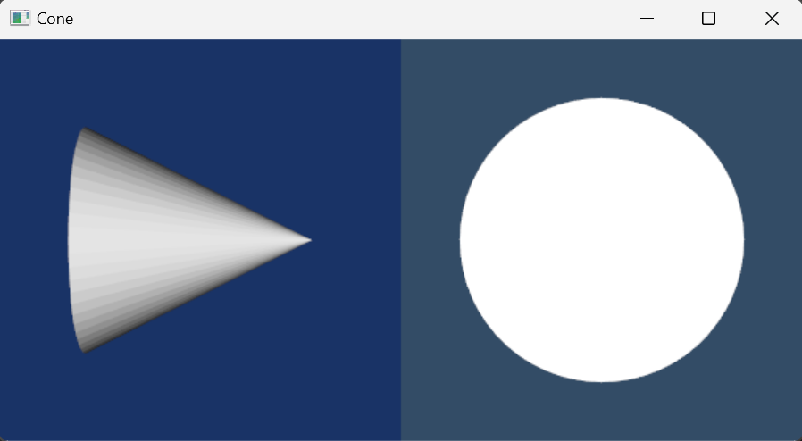
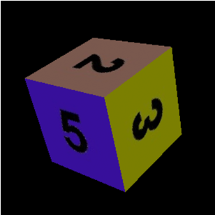

# Lesson 2 - Projections, lighting and transformations

## Outline
* Multiple actors and renderers
* Shading options
* Textures
* Transformations
* Observers and callbacks


# Multiple actors
Open and run the available example cone.py.
Modify the properties of the cone according to the following code:

``` html
coneActor.GetProperty().SetColor(0.2, 0.63, 0.79)
coneActor.GetProperty().SetDiffuse(0.7)
coneActor.GetProperty().SetSpecular(0.4)
coneActor.GetProperty().SetSpecularPower(20)
```

Create a new cone with the following properties (in this case, an object of type vtkProperty is used to store the properties. This method is far preferable when several objects share the same properties)


``` html
#Create a property and directly manipulate it. Assign it to the second actor.

property = vtkProperty()
property.SetColor(1.0, 0.3882, 0.2784)
property.SetDiffuse(0.7)
property.SetSpecular(0.4)
property.SetSpecularPower(20)

# Create a second actor and a property. The property is directly
# manipulated and then assigned to the actor. In this way, a single
# property can be shared among many actors. Note also that we use the
# same mapper as the first actor did. This way we avoid duplicating
# geometry, which may save lots of memory if the geoemtry is large.
coneActor2 = vtkActor()
coneActor2.SetMapper(coneMapper)
coneActor2.SetPosition(0, 2, 0)
coneActor2.SetProperty(property)
```
Change the opacity of the two cones to 0.5, what do you observe?
Notice that the second actor is translated by 2 on the Y axis (with the invocation of the SetPosition method).

# Multiple renderers
using the cone.py example of lesson 1, define another renderer in the same window. To do so, you will have to use the SetViewport(xmin, ymin, xmax, ymax) option [the values ​​are normalized between 0 and 1] to indicate to each renderer which part of the window will be assigned.
Modify the window size to 600 by 300 pixels , with half the window for each renderer.
Modify the initial position of the camera in the second renderer so that it has a 90 degree rotation in azimuth, and then make the cone rotate in both windows by adapting the code from the firts example of lesson 1.
Modify the background color in each Viewport (example: ( 0.1, 0.2, 0.4 ) and ( 0.2, 0.3, 0.4 ) ) to distinguish clearly both.



# Shading options
Modify the code to display two spheres instead of two cones. Change the code in such a way that the shading (Shading) of the second sphere becomes flat. (SetInterpolationToFlat). What do you observe? Try the other options (Gouraud, Phong).

# Textures
Make a VTK program  that allows to visualize a plane (vtkPlaneSource) based on  the example of the Cone with interaction .
Analyze the vtkTexture class and use the VTKXXXReader class to read an image and map it to the created plane. You may use the VTKJPGReader class to read an image and use it as a texture as shown in the following code.

``` html
vtkJPEGReader *JPGReader = vtkJPEGReader::New();
JPGReader->SetFileName(“./images/Lena.jpg”);
...
vtkTexture *aText = vtkTexture::New();
aText->SetInput( (vtkDataObject*) JPGReader->GetOutput() );

planeActor->SetTexture(aText);
```
Try changing the size of the Plane (you can use the setOrigin, SetPoint1 and SetPoint2 methods), what happens to the texture?

# Transformation
Most VTK objects have a given position and orientation (this is the case of vtkSphereSource, vtkConeSource,... which have methods that allow defining the position of the sphere/cone in space).
Despite this, many classes do not allow this type of manipulation, in these situations, it is necessary to define the transformation using the vtkTransformFilter or vtkTransformPolyDataFilter filters as shown in the following code.

``` html
plane = vtkPlaneSource()
  	
# Definition of the transformation (a translation)
MyTransform = vtkTransform()
MyTransform.Translate(0,0,-1)

# Filter definition
MyFilter = vtkTransformPolyDataFilter()

# Tranform end vtkPolydata input to the filter
MyFilter.SetTransform(MyTransform)
MyFilter.SetInput(plane.GetOutput())

planeMapper = vtkPolyDataMapper()
planeMapper.SetInput( MyFilter->GetOutput() )

planeActor = vtkActor()
planeActor.SetMapper( planeMapper )
```

Create six planes and use six different texture images for each one (you may use Im1.jpg, Im2.jpg... Im3.jpg), then use the vtkTransform class to move the planes in such a way that they form a cube. To ease the process, create a function that, given the rotation, translation and name of the image for texture, returns the desired actor.



# Use of callbacks for interaction
An important feature of VTK is the possibility to define Callback functions making it possible to associate to an object a "callback" function to be executed whenever a given event occurs. The association between the function and the event is done using an observer.
Add the following function in the cone with interaction example (cone.py in lesson 02)

``` html
##############################
# Callback for the interaction
##############################
class vtkMyCallback(object):
    def __init__(self, renderer):
        self.ren = renderer

    def __call__(self, caller, ev):
        # Just do this to demonstrate who called callback and the event that triggered it.
        print(caller.GetClassName(), 'Event Id:', ev)
        # Now print the camera position.
        print("Camera Position: %f, %f, %f" % (self.ren.GetActiveCamera().GetPosition()[0],self.ren.GetActiveCamera().GetPosition()[1],self.ren.GetActiveCamera().GetPosition()[2]))
# Callback for the interaction

....

In Code
################################################################
# Here is where we setup the observer, we do a new and ren1 
mo1 = vtkMyCallback(ren)
ren.AddObserver(vtkCommand.AnyEvent,mo1)
################################################################
```

What do you observe when running the program? Try modifying the type of interaction (EndEvent, StartEvent, ResetCameraEvent, etc...)


