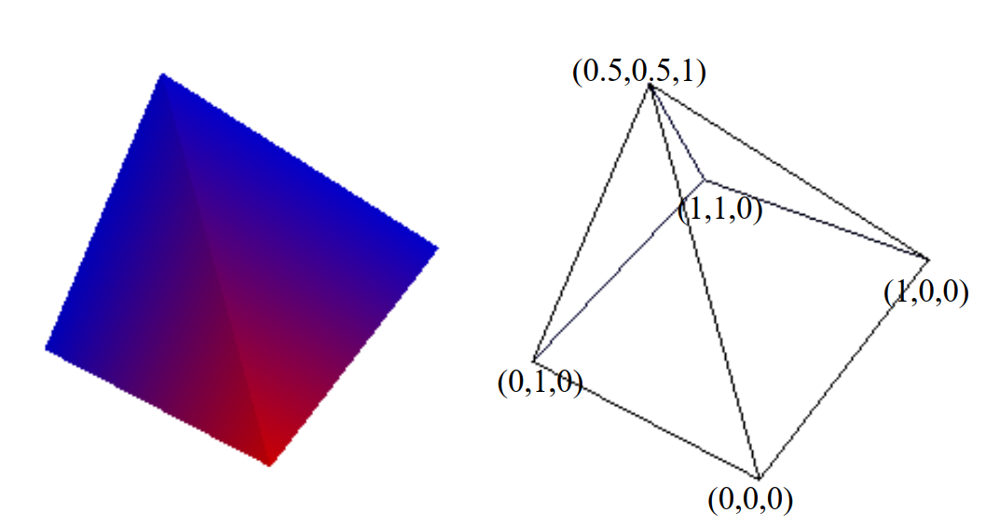
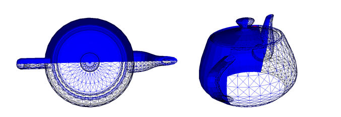

# Lesson 4 - Visualization techniques

## Outline
* Polygonal data
* 3D widgets
* Clipping of a polygonal model


# Polygonal Data
Compile and analyze the program poligonal.py that creates a poligonal cube as a vtkpolydata object. Modify the code to display a tetrahedron.

Modify the code to create the following object.


# 3D widgets
The interactors used so far are used to react to mouse and keyboard events, but have no physical representation in the scene.
In some cases it is important to be able to interact with objects directly exsting in the scene, for example to select a cutting plane. Widgets (Windows Objects) allow this type of interaction. Several widgets are available in VTK: vtkLineWidget, vtkPlaneWidget, vtkImplicitPlaneWidget, vtkBoxWidget, vtkImagePlaneWidget, vtkSphereWidget, vtkSplineWidget.


To use a widget, several steps are required:
1. Instantiate the Widget
2. Specify the vtkRenderWindowInteractor to observe (SetInteractor method)
3. Define the necessary callbacks associated to the Widget. Widgets have the following associated events: StartInteractionEvent, InteractionEvent, and EndInteractionEvent.
4. Most widgets also need to be placed in a certain position in the scene. For that, it is necessary to specify an instance of the vtkProp3D type or a specific position and then invoke the PlaceWidget() method.
5. Finally the Widget has to be activated. By default, the i key is used to activate the Widget.

Compile and test the program widget.py which is a possible solution to the display of coordinate discussed in  lesson 3.

Add a vtkImplicitPlaneWidget to interact with the scene.
At this stage, it is not necessary to define any callbacks, just instantiate and place the plane in the scene. Do not forget to place the widget in the scene (PlaceWidget method) and to associate an interactor to it (SetInteractor method)

``` 
    plane = vtkImplicitPlaneWidget()
    plane.PlaceWidget()
    plane.SetInteractor(iren)
    plane.On()
``` 
You can activate and deactivate the Widget using the I key and try to understand the different types of interaction available.

Using the methods of the vtkImplicitPlaneWidget class, modify the plane so that it appears at the point (1,1,1) and is normal to the X axis.

# Clipping of a polygonal object
Use the vtkVRMLImporter class to view the Teapot.wrl file. You can use the code example below.

``` 

importer = vtkVRMLImporter()
importer.SetRenderWindow(renWin)
importer.SetFileName(".//#04//teapot.wrl")
importer.Read()

renWin = vtkRenderWindow()
importer.SetRenderWindow(renWin)
importer.Read()
``` 

Note that vtkimporter already has an associated renderer (in addition to geometry, lights and other scene properties are also imported), so it is not necessary to create a renderer to view the scene, just a window to  associate to the importer.


The vtkClipPolyData class allows “cutting” a polygonal model according to a clipping function.
Modify the program to clip the Teapot with a plane. The Clipping Output will have to be viewed in Surface mode, while the rest of the model (GetClippedOutput) will have to be viewed in WireFrame mode. The clipping function to be used can be created with the vtkPlane class which manages the implicit function of a plane. Do not forget to activate the option to generate clippedOutput().
Note that the input of the vtkClipPolyData object must be an object of type vtkPolyData. in this example, the model is encapsulated inside the importer renderer and can be accessed with the following code

``` html
# acces to polydate from importer
model = importer.GetRenderer().GetActors().GetLastActor().GetMapper().GetInput()

# clipping plane
clipPlane = vtkPlane()
clipper = vtkClipPolyData()
clipper.SetInputData( teaPotPolyData )
clipper.SetClipFunction( clipPlane )

# acess to clipped output
selectMapper = vtkPolyDataMapper()
selectMapper.SetInputConnection( clipper.GetOutputPort() )
```

Opcional:
Now, modify the program to cut the model interactively by manipulating the cutting plane. To do so, associate a callback to a vtkImplicitPlaneWidget. The implicit function (vtkPlane) will be updated using the getPlane() method of the vtkImplicitPlaneWidget. 
```
# callback function to define inside main to acess variables
def myCallback(obj, event):
    clipPlane, selectActor
    obj.GetPlane(clipPlane)
    selectActor.VisibilityOn() 


# ImplicitPlaneWidget mapped to clip plane inside callback
planeWidget = vtkImplicitPlaneWidget()
planeWidget.SetInteractor( iren )
planeWidget.SetPlaceFactor( 1 )
planeWidget.SetInputData(teaPotPolyData)
planeWidget.PlaceWidget()
planeWidget.AddObserver("InteractionEvent", myCallback)
planeWidget.On()
```
Do not forget to activate the GenerateClippedOutputOn of the clipper and visualize the clipped output as wireframe (clipper.GetClippedOutputPort()).


<!--# Implicit functions and contouring
Compile and test the program implicit.py to visualize 5 contours from a quadric function defined with an implicit function.
Modify the number of contours to display 10 contours instead of 5 (to do so, it is necessary to change the parameters of the GenerateValues ​​function).
Change the sampling volume to a cube centered at the origin and dimension 4 in all directions. What do you  observe (you may see the vtkSampleFunction class documentation). Test further with a sampling volume between 0 and 2 in all directions.
Can you understand which is the defined quadric? what is its equation?

Modify the code to visualize an hyperbolic paraboloid with equation

$x^2-y^2-z=0$

Start by visualizing 5 contours between 0 and 1.2 as in the example provided. Now change the code to display only the curve corresponding to level 0 (you can use the SetValue function instead of GenerateValues).
-->